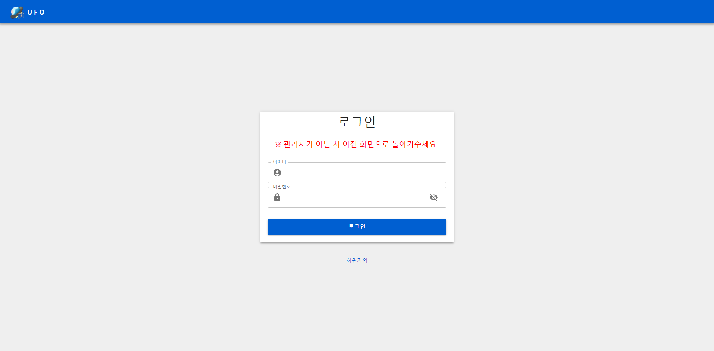
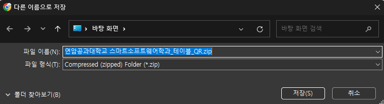
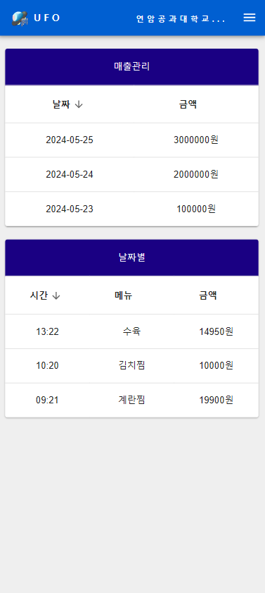

# 프로젝트 정보

<a>


</a>

# 팀원 소개
## PM
PM : 김건우 <br/>
부PM : 손원일 <br/>

## FrontEnd 개발자
팀장 : 김호진<br/>
팀원 : 배준재, 옥준서, 모정환<br/>

## BackEnd 개발자
팀장 : 김재영, 류태웅(DB 팀장)<br/>
팀원 : 최일한<br/>

# 프로젝트 소개
## UFO's
U - University<br/>
F - Festival<br/>
O - Order<br/>
S - System<br/>

기존 축제 또는 행사에서의 사업자 등록 없이 계좌이체로 계산하는 시스템을 적은 인력으로도 운영할 수 있게 도와주는 편한 서비스

# 핵심 기능
- 간편한 QR 코드 주문 시스템: 누구나 쉽게 이용할 수 있도록 웹/앱 대신 간편한 QR 코드 주문 시스템을 활용
- SMS 기반 결제 확인 시스템: 번거로운 계좌이체 대신 실시간 SMS 알림으로 결제 확인 및 주문 승인 과정을 간소화 
- 실시간 주방 디스플레이 시스템: 조리 진행 상황을 실시간으로 확인할 수 있는 디스플레이 시스템으로 주방 운영 효율성 극대화 
- 사업자 등록 없이 구현 가능: 사업자 등록 없이도 손쉽게 구축 및 운영 가능한 시스템으로, 다양한 축제 및 행사에 적용 가능성이 높음
- 메뉴 사진 및 설명 첨부: 고객이 메뉴를 직관적으로 확인하고 선택할 수 있도록 메뉴 사진 및 설명을 첨부

# 장점
- 비용 절감: 사업자 등록 없이 간단한 QR코드 및 SMS 시스템을 활용하여 저렴한 운영을 가능
- 운영 효율화: 실시간 주문 및 조리 상황 확인, 주문 조율 기능을 통해 효율적인 운영 지원
- 고객 만족도 향상: 빠르고 편리한 주문 및 결제, 투명한 주문 진행 확인 시스템을 통해 고객의 만족도를 높임
- 데이터 기반 의사 결정: 주문 데이터 분석을 통해 메뉴 인기, 운영 패턴 등을 파악하여 데이터 기반 의사 결정을 지원
- 환경 친화: 종이 영수증 발급 없이 모바일 기반 주문 및 결제 시스템으로 환경 보호에 기여


# 화면구성
## 관리자 데스크톱
### 로그인 / 회원가입 / 개인정보 수정



### 주문 결제 관리


### 메뉴 관리


### 매출 관리


### 테이블 QR 생성


### QR 생성시




## 관리자 모바일
### 모바일 접속 로그인


### 모바일 메인화면


### 주방 디스플레이


### 모바일 매출 확인



## 사용자화면
### 메인화면


### 주문화면
<div>


</div>


### 상세 주문 내역 확인
<div>


</div>


# 사용 기술
## 공통
- Visual Studio Code: 통합 개발 환경(IDE)
- Git, GitHub: 코드 관리 및 협업

## Frontend
### 개발 도구 및 IDE
- Vite(v5.2.0): 개발 서버 및 번들러

### 패키지 매니저
- npm(v20.11.1): JavaScript 패키지 관리자

### 기타 도구
- ESLint: JavaScript 코드 스타일 검사 도구
- Prettier: 코드 포맷터

## Backend
### 패키지 매니저
- npm: Node.js 패키지 관리자

### 런타임 환경
- Node.js: JavaScript 런타임 환경

## DB
### 데이터베이스 관리 도구
- MySQL Workbench: 데이터베이스 관리 도구

# 사용 라이브러리
## 프론트엔드 관련
- React(v18.2.66): 프론트엔드 개발을 위한 라이브러리
- Material-UI(v5.15.20): UI 스타일링 컴포넌트 라이브러리
- Vite(v5.2.0): 개발 서버 및 번들러
- react-router-dom(v6.22.3): 클라이언트 측 라우팅
- react-qr-code(v2.0.13): QR 코드 생성
- react-device-detect(v2.2.3): 사용자 기기 인식

## 백엔드 관련
- Node.js 패키지
- Express.js: 웹 서버 구현을 위한 라이브러리
- Socket.IO: 실시간 양방향 통신
- axios(v1.7.2): 서버 통신용 라이브러리

## 보안 및 코드 품질 도구
- ESLint: JavaScript 코드 스타일 검사 도구
- Prettier: 코드 포맷터

# 시작 가이드
## 설치 필요
- Node.js 20.11.1
- Npm 10.5.0

## 시작

```
npm install
npm run dev
```
